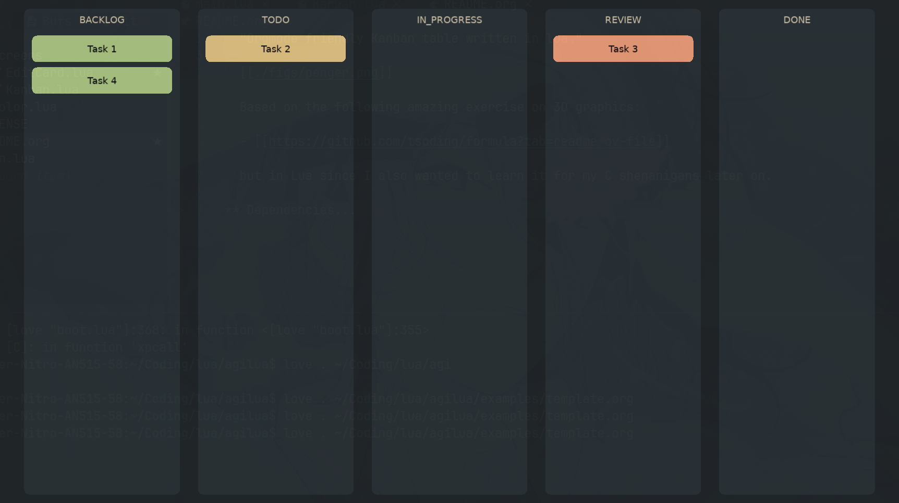

* Agilua
  "Orgmode friendly Kanban table written in lua."

  Easy visualization of your orgmode task lists in a kanban table.

  

** Dependencies
   ~Love2D~ [[https://love2d.org/]].

** Installation and usage
   - ~git clone~ the repository and run it with ~Love2d~ passing the org file path:
     #+begin_src shell
      love /path/to/Agilua /path/to/org-file.org
     #+end_src
   - A template org file can be found at ~examples/~.
